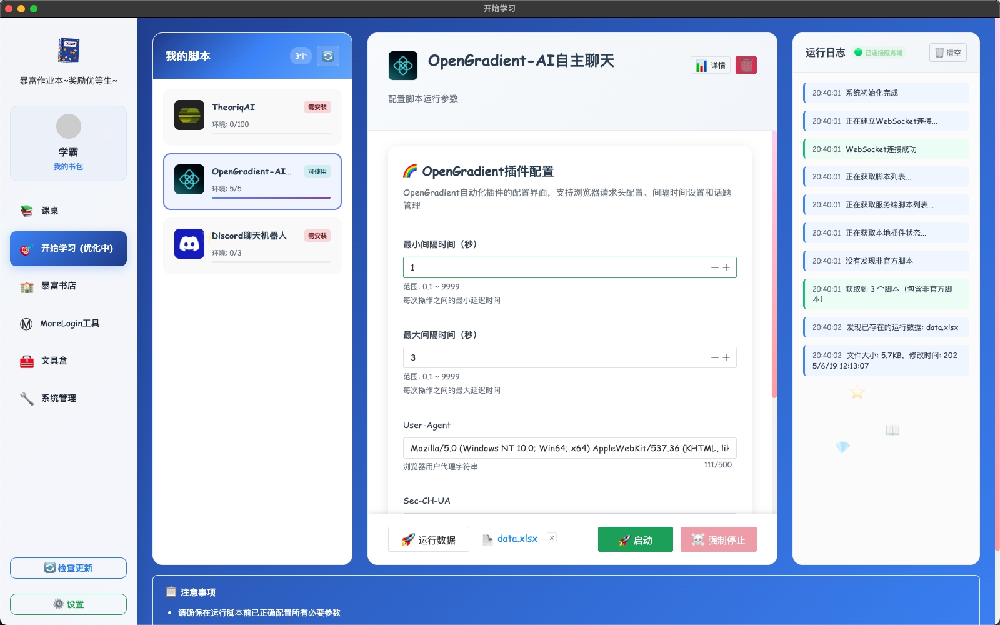

# 🚀 BoomBook - 全能Web3自动化脚本平台

<div align="center">

[](https://github.com/BoomBook888/BoomBook888)
[](https://github.com/BoomBook888/BoomBook888/releases)
[](#)
[](#)

### 🎯 **一站式Web3自动化工具平台，集成区块链、社交媒体、交易所等多种自动化功能**

<div align="center">
  <a href="#-功能特性">🎯 功能特性</a> • 
  <a href="#-功能展示">📸 功能展示</a> • 
  <a href="#️-安装使用">🛠️ 安装使用</a>
</div>

</div>

<br>

---

<br>

## 📋 项目简介

<div align="center">

**🎯 专为区块链空投猎人打造的专业脚本平台**

</div>

> BoomBook是一个功能强大的Web3自动化脚本平台，专为区块链空投猎人开发，我们的宗旨是用脚本做精品好，所有脚本均为私人开发，绝不套用市面上的任何开源脚本，所有脚本均有环境上限先到先得，价格门槛低适合各个阶段的猎人使用！

<br>

### 🎯 核心优势

<table>
<tr>
<td align="center">🔒</td>
<td><strong>安全可靠</strong><br>多重安全验证，本地私钥管理</td>
<td align="center">🧩</td>
<td><strong>插件系统</strong><br>可扩展的模块化架构</td>
</tr>
<tr>
<td align="center">🌐</td>
<td><strong>跨平台</strong><br>支持Windows、macOS</td>
<td align="center">⚡</td>
<td><strong>高性能</strong><br>异步处理，高并发执行</td>
</tr>
<tr>
<td align="center">🎨</td>
<td><strong>现代界面</strong><br>基于Electron的桌面应用</td>
<td align="center">🔄</td>
<td><strong>自动更新</strong><br>智能版本检测与更新</td>
</tr>
</table>

<br>

---

<br>

## 🎯 功能特性

### 💼 脚本自动化

<div align="left">

```
🏦 CEX 提币         - 支持OKX，币安等主流交易所
🌐 HTTP协议脚本     - 随时上新各种项目的脚本，快速稳定，操作简单！
🖥️ 前端自动化       - 基于MoreLogin指纹浏览器实现前端自动化批量脚本，安全可靠，不女巫！
🎯 打新脚本         - four平台打新，批量转账脚本。
```

</div>

### 🤖 社交媒体自动化

<div align="left">

```
🤖 Discord机器人    - 自动化社区管理和互动，高自由度的AI配置，根据你的需求个性配置。
🐦 Twitter工具      - 批量操作、内容发布
```

</div>

### 🔧 开发工具

<div align="left">

```
⏰ 脚本调度         - 定时任务和事件触发
📊 日志监控         - 详细的执行日志和错误追踪
⚙️ 配置管理         - 灵活的参数配置和环境切换
```

</div>

<br>

---

<br>

## 📸 功能展示

### 🛒 脚本超市（下图价格仅作为参考）
<div align="center">

</div>

> 💰 **价格根据脚本开发难以程度定价，绝不坐地起价！环境数量定好后绝不更改为保证每一位用户的利益。**

<br>

### 🧰 Web3工具箱
<div align="center">

</div>

> 🛠️ **实用的web3工具箱，你提要求我审核，我开发，主打一个听劝！**

<br>

### 🤖 Discord自动化
<div align="center">

</div>

> 🎯 **强大的Discord机器人功能，自动化社区管理和用户互动，可自动回复@，可自定义多种模型AI，自定义提示词及AI其他性能参数。**

<br>

### 🐦 Twitter自动化（更好用的嘴遁Twitter正在研发中……）
<div align="center">

</div>

> ⚠️ **当前实用不稳定，垃圾twitter容易被封号，谨慎使用！**

<br>

### 🚀 自动化启动平台（还在持续优化中……）
<div align="center">

</div>

> 📋 **完善的脚本配置界面，主打一个简单实用，excel一键启动，安全可靠，纯本地化运行，运行日志均可看到。**

<br>

---

<br>

## 🏗️ 技术架构

<div align="center">


</div>

<br>

---

<br>

## 🛠️ 安装使用

### 📋 系统要求

<div align="center">

| 项目 | 要求 |
|------|------|
| **操作系统** | Windows 10+, macOS 10.14+ |
| **⚠️ 重要提示** | macOS系统仅支持M系芯片，Intel芯片Mac均不支持！ |

</div>

<br>

### 🚀 快速开始

#### 📥 1. 下载安装包

<div align="center">

```bash
# 从Releases页面下载对应平台的安装包
# Windows: BoomBook-v1.0.0-win32-x64.exe
# macOS: BoomBook-v1.0.0-darwin-arm64.dmg
```

[](https://github.com/BoomBook888/BoomBook888/releases)
[](https://github.com/BoomBook888/BoomBook888/releases)

</div>

<br>

#### 🔧 2. 安装应用程序

<table>
<tr>
<td align="center"><strong>🪟 Windows</strong></td>
<td>双击exe文件，按向导完成安装</td>
</tr>
<tr>
<td align="center"><strong>🍎 macOS</strong></td>
<td>拖拽到Applications文件夹<br><br><strong>⚠️ 注意：需要开放权限，在终端运行命令</strong><br><code>sudo xattr -r -d com.apple.quarantine /Applications/BoomBook.app</code></td>
</tr>
</table>

<br>

#### 👤 3. 注册账号

<div align="center">

> 🔑 **注册账号是必须要用注册码的，注册码可以到dc群要，或者私信官方twitter**

</div>

<br>

---

<br>

## 🔒 安全说明

<div align="center">

### 🛡️ 我们的安全承诺

</div>

<table>
<tr>
<td align="center">🔐</td>
<td><strong>私钥安全</strong></td>
<td>本平台不会保存任何敏感数据，更不会上传到服务器，所以也不会对用户数据负责</td>
</tr>
<tr>
<td align="center">🛡️</td>
<td><strong>API安全</strong></td>
<td>支持API密钥加密存储和访问控制</td>
</tr>
<tr>
<td align="center">🔍</td>
<td><strong>代码审计</strong></td>
<td>不会向任何人开源代码，避免被钻漏洞，和保护用户权益</td>
</tr>
<tr>
<td align="center">⚠️</td>
<td><strong>风险提示</strong></td>
<td>请保管好你的私钥文件，不要向任何人透露，定期给电脑做好安全扫描，避免病毒</td>
</tr>
</table>

<br>

---

<br>

## 📊 项目状态

<div align="center">

<table>
<tr>
<td align="center">✅</td>
<td><strong>稳定版本</strong></td>
<td><code>v1.0.0</code></td>
</tr>
<tr>
<td align="center">🔄</td>
<td><strong>活跃开发</strong></td>
<td>持续更新中</td>
</tr>
<tr>
<td align="center">🌟</td>
<td><strong>社区支持</strong></td>
<td>200人为上限（不定期开放名额）</td>
</tr>
<tr>
<td align="center">📝</td>
<td><strong>文档完善</strong></td>
<td>详细使用文档和脚本教程</td>
</tr>
</table>

</div>

<br>

---

<br>

## 🤝 贡献指南

<div align="center">

**我们欢迎所有形式的贡献！**

</div>

### 🎯 贡献方式

<div align="left">

- **🐛 Bug报告**: 提交Issue描述遇到的问题，或在官方dc提交
- **💡 功能建议**: 分享您的想法和建议
- **📖 文档改进**: 完善项目文档

</div>

<br>

---

<br>

## 📞 联系我们

<div align="center">

### 🌐 官方渠道

<br>

[](https://x.com/Boom_Book_888)
[](https://discord.gg/HB8wKc2c7F)

<br>

| 平台 | 链接 | 说明 |
|------|------|------|
| 🐦 **Twitter** | [BoomBook 点击查看](https://x.com/Boom_Book_888) | 最新动态和公告 |
| 💬 **Discord** | [BoomBook官方DC 点击加入](https://discord.gg/HB8wKc2c7F) | 社区交流和技术支持 |

</div>

<br>

---

<div align="center">

<br>

## 🌟 如果这个项目对您有帮助，请给我们一个 ⭐ Star!

<br>

**Made with ❤️ by BoomBook Team**

<br>

---

<sub>© 2024 BoomBook. All rights reserved.</sub>

</div>
